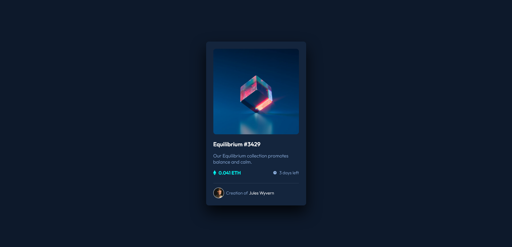

# Frontend Mentor - NFT preview card component solution

This is a solution to the [NFT preview card component challenge on Frontend Mentor](https://www.frontendmentor.io/challenges/nft-preview-card-component-SbdUL_w0U). Frontend Mentor challenges help you improve your coding skills by building realistic projects. 

## Table of contents

- [Overview](#overview)
  - [The challenge](#the-challenge)
  - [Screenshot](#screenshot)
  - [Links](#links)
- [My process](#my-process)
  - [Built with](#built-with)
  - [What I learned](#what-i-learned)
  - [Continued development](#continued-development)
  - [Useful resources](#useful-resources)
- [Author](#author)
- [Acknowledgments](#acknowledgments)

## Overview

### The challenge

Users should be able to:

- View the optimal layout depending on their device's screen size
- See hover states for interactive elements

### Screenshot



### Links

- Live Site URL: [GitHub Pages](https://ekolpakova.github.io/nft-preview-card-component-main/)

## My process

### Built with

- Semantic HTML5 markup
- CSS custom properties
- Flexbox

### What I learned

Use this section to recap over some of your major learnings while working through this project. Writing these out and providing code samples of areas you want to highlight is a great way to reinforce your own knowledge.

To see how you can add code snippets, see below:

```html
<div class="card__head">
  
  <div class="card__overlay"></div>
  <div class="equilibrium-view"></div>
</div>
```
```css
.card__head {
  position: relative;
}

.card__image {
  width: 100%;
}

.card,
.card__image {
  border-radius: 10px;
}

.card__overlay {
  position: absolute;
  opacity: 0;
  top: 0;
  right: 0;
  bottom: 0;
  left: 0;
  width: 100%;
  height: calc(100% - 4px);
  background-color: var(--cyan);
  border-radius: 10px;
}

.equilibrium-view {
  position: absolute;
  opacity: 0;
  top: 50%;
  left: 50%;
  font-size: 3em;
  color: var(--white);
  transform: translate(-50%, -50%);
}
```

### Continued development

Use this section to outline areas that you want to continue focusing on in future projects. These could be concepts you're still not completely comfortable with or techniques you found useful that you want to refine and perfect.

**Note: Delete this note and the content within this section and replace with your own plans for continued development.**

### Useful resources
- [MDN Web Docs](https://developer.mozilla.org/en-US/) - Amazing web reference.
- [CSS Tricks](https://css-tricks.com) - This helped me to figure out some CSS properties like transition & box-shadow.

## Author

- Frontend Mentor - [@ekolpakova](https://www.frontendmentor.io/profile/ekolpakova)
- Twitter - [@eesunnygirl](https://www.twitter.com/eesunnygirl)

## Acknowledgments

This solution helped me figure out how to adjust overlay height.
- [Chris P Github Repository](https://github.com/TheChrisP/NFT-preview-card-component)

